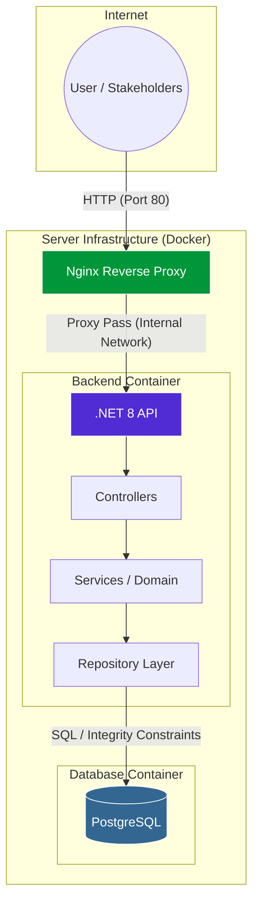

📌 Overview
This project was developed for SergipeTec (Sergipe Technological Park) to solve a critical institutional challenge: the centralized management and monitoring of performance goals and government contracts.
As the Lead Developer, I was responsible for the entire lifecycle of the application, ensuring a robust, scalable, and secure environment for multiple stakeholders, including government secretaries and internal planning departments.

🏗️ The Engineering Challenge
The institution relied on fragmented data across different sectors. The goal was to build a system that:

Ensured Data Integrity: Performance goals and evidence files needed to be audit-ready.
Automated Reporting: Reduction of human error in quarterly reporting for stakeholders.
High Availability & Security: A system capable of handling sensitive institutional data with secure access.

🛠️ Architectural Decisions
1. N-Tier Layered Architecture
I implemented a Clean / Layered Architecture to decouple business logic from infrastructure concerns.
This approach ensures high maintainability, scalability, and testability. Changes in infrastructure (database, services, cloud providers) do not affect core business rules.
2. Infrastructure & System Design
The system runs in a containerized environment designed for security, abstraction, and scalability.

3. Database Modeling
I designed a relational schema focused on referential integrity and auditability.
Challenge: Managing complex institutional programs, each with multiple KPIs, evidence files, deadlines, and historical revisions.
Solution: A fully normalized relational model with:

Evidence traceability
Referential constraints
Dashboard data tracking

This ensures data reliability, traceability, and legal compliance.
4. Security & DevOps
Containerization: Used Docker to encapsulate the environment, ensuring the app runs identically in development and production.
Reverse Proxy (Nginx): Configured as a centralized entry point to manage:

Service Abstraction: Hiding internal container ports (5137 and 8080) from direct public exposure.
Traffic Orchestration: Handling Frontend, REST API, and WebSocket (SignalR) traffic through a single port.
Performance Tuning: Optimized for large data transfers with custom client_max_body_size (1000M) and extended proxy timeouts to handle complex institutional reports.

🚀 Key Achievements

Full-Cycle Ownership: From stakeholder interviews and requirements engineering to architecture design and production deployment.
Process Automation: Automated reporting pipelines significantly reduced administrative workload and eliminated manual data inconsistencies.
Enterprise Reliability: Delivered a production-grade platform for government contract management.

🧠 Lessons Learned

Stakeholder Communication: Translating complex government regulations into clean technical specifications.
Enterprise Software Engineering: Designing for maintainability, auditability, and scalability.
Security-First Mindset: Building defense-in-depth architectures for institutional systems.

📈 Impact
The platform is currently the primary system used to monitor management contracts at SergipeTec, ensuring transparency, accountability, and operational efficiency for SEDETEC (Secretariat of State for Economic Development, Science, and Technology).

Note: This is a technical case study. The source code is private and owned by SergipeTec.
